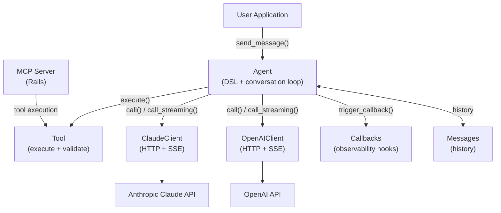

## What is ActiveIntelligence?

ActiveIntelligence is a Ruby gem that makes it straightforward to build AI agents powered by Claude (Anthropic's LLM). You define agents and their capabilities using a clean class-level DSL, register tools that Claude can call during a conversation, and get back structured responses — either all at once or streamed in real time.

It handles the full conversation loop: sending messages, detecting tool calls in Claude's response, executing those tools, feeding results back to Claude, and repeating until the model returns a final answer.

## How It Works



## Core Concepts

| Concept | What it is |
|---------|-----------|
| [**Agent**](key_concepts/agent) | The central class that owns the conversation, calls the API, and orchestrates tools |
| [**Tool**](key_concepts/tool) | A capability Claude can invoke — defined with a DSL, validated, and executed server-side |
| [**Messages**](key_concepts/messages) | The typed message objects that make up conversation history |
| [**Memory**](key_concepts/memory) | How conversation history is stored — in-memory or ActiveRecord-backed |
| [**Callbacks**](key_concepts/callbacks) | Observability hooks that fire at every stage of the agent lifecycle |
| [**MCP**](key_concepts/mcp) | A Rails controller base class for exposing tools as a Model Context Protocol server |

## Quick Start

```bash
gem install activeintelligence
export ANTHROPIC_API_KEY="sk-ant-..."
```

```ruby
require "activeintelligence"

class MyAgent < ActiveIntelligence::Agent
  model :claude
  memory :in_memory
  identity "You are a helpful assistant."
end

agent = MyAgent.new
puts agent.send_message("Hello!")
```

See [Setup](how_tos/setup) for full installation and configuration details.

## Documentation

### Key Concepts
- [Agent](key_concepts/agent) — The conversation manager: DSL, lifecycle, tool loop
- [Tool](key_concepts/tool) — Defining callable capabilities with validation and error handling
- [Messages](key_concepts/messages) — UserMessage, AgentResponse, ToolResponse and how history is built
- [Memory](key_concepts/memory) — In-memory and ActiveRecord memory strategies
- [Callbacks](key_concepts/callbacks) — The 16 observability hooks and their typed payloads
- [MCP](key_concepts/mcp) — Exposing tools as a Model Context Protocol server in Rails

### How-To Guides
- [Setup](how_tos/setup) — Installation, environment variables, and global configuration
- [Create an Agent](how_tos/create_an_agent) — Build and run your first agent
- [Create a Tool](how_tos/create_a_tool) — Define tools with parameters and error handling
- [Streaming](how_tos/streaming) — Real-time streamed responses
- [Rails Integration](how_tos/rails_integration) — Persistent conversations with ActiveRecord
- [OpenAI](how_tos/openai) — Use OpenAI as an alternative LLM provider

### Workflows
- [Message Flow](workflows/message_flow) — End-to-end path from user input to final response
- [Tool Calling Loop](workflows/tool_calling_loop) — How multi-tool, multi-turn execution works
- [Frontend Tools](workflows/frontend_tools) — Deferring tool execution to the client and resuming
- [Streaming Pipeline](workflows/streaming_pipeline) — SSE parsing, chunk accumulation, and tool streaming
