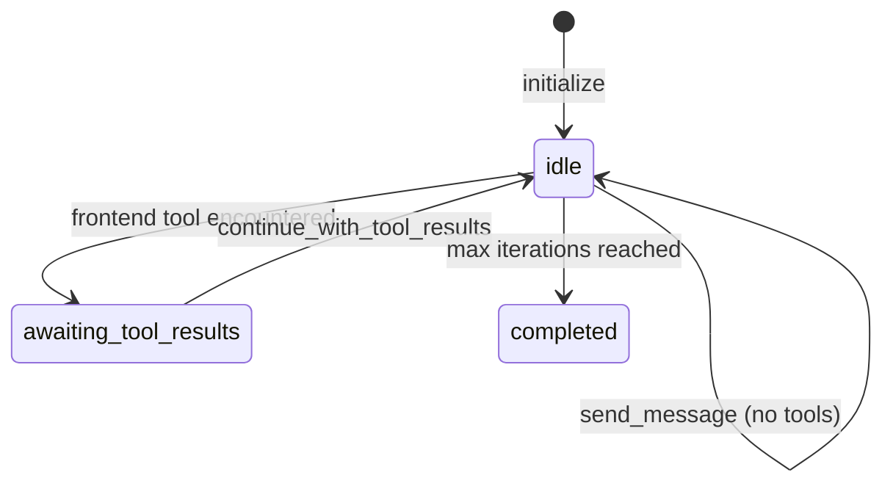

## Overview

`ActiveIntelligence::Agent` is the main building block of the library. Subclass it, configure it with the DSL, and you get a stateful conversation manager that handles message history, LLM API calls, and the full tool-calling loop automatically.

Each agent instance owns a single conversation. Multiple users each get their own instance.

```mermaid
classDiagram
    class Agent {
        +STATES idle|awaiting_tool_results|completed
        +messages []
        +state String
        +session Session
        +current_turn Turn
        +send_message(msg, stream:) String
        +continue_with_tool_results(results, stream:)
        +paused_for_frontend?() bool
    }
    class ClaudeClient {
        +call()
        +call_streaming()
    }
    class OpenAIClient {
        +call()
        +call_streaming()
    }
    class Tool {
        +call(params)
        +execute(params)
    }
    class Callbacks {
        +trigger_callback(hook, payload)
    }

    Agent --> ClaudeClient : uses (model :claude)
    Agent --> OpenAIClient : uses (model :openai)
    Agent --> Tool : executes registered tools
    Agent --> Callbacks : fires lifecycle hooks

    click Agent href "#" "lib/activeintelligence/agent.rb:3-821"
    click ClaudeClient href "#" "lib/activeintelligence/api_clients/claude_client.rb"
    click OpenAIClient href "#" "lib/activeintelligence/api_clients/openai_client.rb"
    click Tool href "#" "lib/activeintelligence/tool.rb"
    click Callbacks href "#" "lib/activeintelligence/callbacks.rb"
```

## DSL

All configuration happens at the class level before instantiation.

```ruby
class MyAgent < ActiveIntelligence::Agent
  model :claude           # :claude (default) or :openai
  memory :in_memory       # :in_memory (default) or :active_record
  identity "You are a helpful assistant."
  tool MyFirstTool
  tool MySecondTool
end
```

| DSL Method | Purpose | Source |
|-----------|---------|--------|
| `model` | Select LLM provider | `agent.rb:23-26` |
| `memory` | Select memory strategy | `agent.rb:28-31` |
| `identity` | Set the system prompt | `agent.rb:33-36` |
| `tool` | Register a tool class | `agent.rb:38-41` |
| `tools` | Read registered tools | `agent.rb:43-45` |

Subclasses inherit all parent configuration. Adding a `tool` in a subclass does not affect the parent.

## Instantiation

```ruby
# Simple — in-memory conversation
agent = MyAgent.new

# With context (made available to tools via tool.context)
agent = MyAgent.new(context: { current_user: user })

# With an ActiveRecord conversation (persists history)
agent = MyAgent.new(conversation: conversation_record)
```

The initializer (`agent.rb:51-75`) sets up:
- `@messages` — conversation history array
- `@state` — starts as `STATES[:idle]`
- `@session` / `@current_turn` — observability tracking objects
- `@api_client` — Claude or OpenAI client based on `model`

## Sending Messages

```ruby
# Static — returns the full response string
response = agent.send_message("What is the capital of France?")

# Streaming — yields chunks as they arrive
agent.send_message("Tell me a story.", stream: true) do |chunk|
  print chunk
end
```

`send_message` (`agent.rb:84-126`) dispatches to `send_message_static` or `send_message_streaming` based on the `stream:` flag. Both paths:
1. Add a `UserMessage` to history
2. Call the API
3. Enter the tool-calling loop if the response contains tool calls
4. Return the final text

## Agent States



| State | Value | Meaning |
|-------|-------|---------|
| `idle` | `"idle"` | Ready to accept messages |
| `awaiting_tool_results` | `"awaiting_tool_results"` | Paused for frontend tool execution |
| `completed` | `"completed"` | Max iterations (25) reached |

Check state with `agent.paused_for_frontend?` (`agent.rb:218-219`).

## Tool Calling Loop

When Claude returns tool calls, the agent executes them and feeds results back automatically. The loop repeats until Claude returns a plain text response or the 25-iteration limit is hit.

See [Tool Calling Loop](../workflows/tool_calling_loop) for the full sequence.

## Frontend Tool Deferral

Some tools run on the client (browser/mobile). When the agent encounters one, it pauses and returns a structured response describing which tool to run and with what parameters. The client executes the tool and resumes the agent:

```ruby
result = agent.send_message("Do the thing")

if agent.paused_for_frontend?
  # result contains pending tool info — client executes the tool
  agent.continue_with_tool_results({ "tool_use_id" => "...", "result" => "..." })
end
```

See [Frontend Tools](../workflows/frontend_tools) for the full workflow.

## Callbacks / Observability

Agents include the `Callbacks` module, which provides 16 lifecycle hooks:

```ruby
class MyAgent < ActiveIntelligence::Agent
  on_turn_start do |turn|
    Rails.logger.info "Turn started: #{turn.id}"
  end

  on_tool_end do |execution|
    Metrics.record(execution.name, execution.duration)
  end
end
```

See [Callbacks](callbacks) for all available hooks and payload types.
