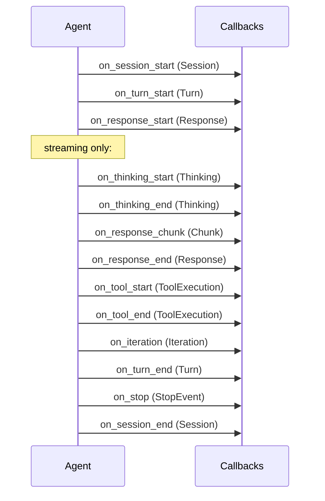

## Overview

The `Callbacks` module (included in every `Agent` subclass) fires typed events at every meaningful point in the agent lifecycle — session start/end, turn start/end, API calls, streaming chunks, tool execution, errors, and stop conditions.

Callbacks don't interrupt the main flow. If a callback handler raises, the error is rescued and execution continues.

Source: `callbacks.rb:323-386`

## Registering Callbacks

Register callbacks at the class level using hook methods:

```ruby
class MyAgent < ActiveIntelligence::Agent
  on_session_start do |session|
    Rails.logger.info "Session #{session.id} started"
  end

  on_tool_end do |execution|
    Datadog::Statsd.histogram("tool.duration", execution.duration, tags: ["tool:#{execution.name}"])
  end

  on_error do |error_ctx|
    Sentry.capture_exception(error_ctx.error)
  end
end
```

Callbacks inherit from parent to subclass. Adding a hook in a subclass doesn't affect the parent.

## Hook Reference



| Hook | Payload | When it fires |
|------|---------|--------------|
| `on_session_start` | `Session` | Agent receives first message |
| `on_session_end` | `Session` | `end_session` called or session completes |
| `on_turn_start` | `Turn` | Each call to `send_message` |
| `on_turn_end` | `Turn` | Turn completes (after all tool loops) |
| `on_response_start` | `Response` | API call begins |
| `on_response_end` | `Response` | API call completes |
| `on_response_chunk` | `Chunk` | Each streamed text chunk (streaming only) |
| `on_thinking_start` | `Thinking` | Extended thinking block starts (streaming) |
| `on_thinking_end` | `Thinking` | Extended thinking block ends (streaming) |
| `on_tool_start` | `ToolExecution` | Before a tool's `execute` is called |
| `on_tool_end` | `ToolExecution` | After a tool returns a response |
| `on_tool_error` | `ToolExecution` | When a tool raises an unhandled error |
| `on_message_added` | `Message` | Any message added to history |
| `on_iteration` | `Iteration` | Each pass through the tool-calling loop |
| `on_error` | `ErrorContext` | Any unhandled error during processing |
| `on_stop` | `StopEvent` | Agent stops for any reason |

## Payload Types

### Session

Tracks the full lifetime of an agent instance across multiple turns.

```ruby
session.id                  # UUID
session.agent_class         # "MyAgent"
session.created_at          # Time
session.ended_at            # Time (after end_session)
session.total_turns         # Integer
session.total_input_tokens  # Integer (accumulated)
session.total_output_tokens # Integer (accumulated)
session.duration            # Float (seconds)
```

Source: `callbacks.rb:6-41`

### Turn

Tracks a single call to `send_message`.

```ruby
turn.id              # UUID
turn.user_message    # String
turn.started_at      # Time
turn.ended_at        # Time
turn.session_id      # String
turn.iteration_count # Integer (tool loop passes)
turn.usage           # Usage object
turn.duration        # Float (seconds)
```

Source: `callbacks.rb:43-78`

### Response

Tracks a single API call to the LLM.

```ruby
response.id          # UUID
response.is_streaming # Boolean
response.content     # String (full text)
response.stop_reason # String
response.model       # String
response.tool_calls  # Array
response.usage       # Usage object
response.duration    # Float (seconds)
```

Source: `callbacks.rb:80-121`

### Chunk

A single streamed text fragment.

```ruby
chunk.content     # String (text fragment)
chunk.index       # Integer (position in stream)
chunk.response_id # String
```

Source: `callbacks.rb:123-139`

### ToolExecution

Tracks a single tool call from detection to result.

```ruby
execution.name        # "get_weather"
execution.tool_class  # WeatherTool
execution.input       # { city: "Paris" }
execution.tool_use_id # "toolu_01"
execution.result      # Hash (success/error response)
execution.error       # Exception (if any)
execution.started_at  # Time
execution.ended_at    # Time
execution.duration    # Float (seconds)
execution.success?    # Boolean
```

Source: `callbacks.rb:172-213`

### Usage

Token accounting for a single response or accumulated across a session.

```ruby
usage.input_tokens           # Integer
usage.output_tokens          # Integer
usage.cache_read_tokens      # Integer
usage.cache_creation_tokens  # Integer
usage.total_tokens           # input + output
usage.add(other_usage)       # accumulate
```

Source: `callbacks.rb:215-246`

### Iteration

Fired at each pass through the tool-calling loop.

```ruby
iteration.number          # Integer (1-based)
iteration.tool_calls_count # Integer
iteration.turn_id         # String
iteration.timestamp       # Time
```

Source: `callbacks.rb:248-266`

### StopEvent

Explains why the agent stopped.

```ruby
stop.reason   # :max_turns | :user_stop | :error | :complete | :frontend_pause
stop.details  # Hash (optional context)
```

Source: `callbacks.rb:298-320`

### ErrorContext

Wraps an exception with context for the `on_error` hook.

```ruby
error_ctx.error        # Exception
error_ctx.error_class  # "Net::TimeoutError"
error_ctx.message      # "execution expired"
error_ctx.backtrace    # Array<String>
error_ctx.context      # Hash (optional)
```

Source: `callbacks.rb:268-296`

## Implementation

`trigger_callback` (`callbacks.rb:372-384`) iterates all handlers registered for a hook and calls each with the payload. Errors in handlers are rescued so they never break the agent's main flow.

```ruby
def trigger_callback(hook_name, *args)
  (callbacks[hook_name] || []).each do |handler|
    handler.call(*args)
  rescue => e
    # callback errors don't crash the agent
  end
end
```
