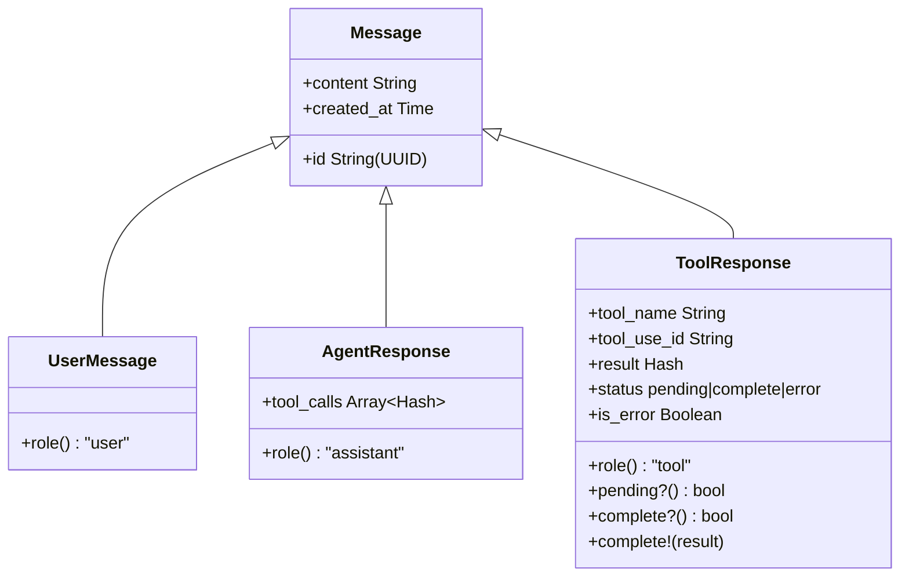

## Overview

Every exchange in a conversation is stored as a typed message object in the agent's `@messages` array. These objects are the source of truth for conversation state. Before each API call, the agent converts them to the format each provider expects.

There are three message types, each with a distinct `role`:



## UserMessage

Represents a message from the user. Created by `send_message` before the API call.

```ruby
# Created internally by the agent
msg = UserMessage.new(content: "What is the weather in Paris?")
msg.role  # => "user"
```

Source: `messages.rb:16-20`

## AgentResponse

Represents Claude's reply. Stores both the text content and any tool calls Claude requested.

```ruby
msg = AgentResponse.new(
  content: "I'll check the weather for you.",
  tool_calls: [
    { "id" => "toolu_01", "name" => "get_weather", "input" => { "city" => "Paris" } }
  ]
)
msg.role  # => "assistant"
```

When `tool_calls` is non-empty, the agent enters the tool-calling loop. The content may be empty if Claude goes straight to a tool call.

Source: `messages.rb:93-109`

## ToolResponse

Represents the result of a tool execution. Has a lifecycle: created as `pending` when the agent encounters a tool call, then transitioned to `complete` or `error` after execution.

```ruby
# Created by agent when tool call is detected
response = ToolResponse.new(
  tool_name: "get_weather",
  tool_use_id: "toolu_01",
  parameters: { city: "Paris" }
)
response.pending?  # => true

# After execution
response.complete!({ temperature: "15°C", condition: "Cloudy" })
response.complete?  # => true
response.status     # => "complete"
```

The `pending` status is significant for **frontend tools** — a ToolResponse stays `pending` until the client executes the tool and calls `continue_with_tool_results`. The agent filters out pending responses when formatting messages for the API.

Source: `messages.rb:22-91`

### ToolResponse Statuses

| Status | Meaning |
|--------|---------|
| `pending` | Tool call detected, not yet executed |
| `complete` | Tool executed successfully |
| `error` | Tool execution failed |

## Conversation History Structure

A typical tool-using conversation builds up like this:

```
UserMessage        "What's the weather in Paris?"
AgentResponse      content: "", tool_calls: [{name: "get_weather", ...}]
ToolResponse       tool_name: "get_weather", status: complete, result: {...}
AgentResponse      content: "The weather in Paris is 15°C and cloudy."
```

Multi-tool turns add multiple `ToolResponse` entries before the final `AgentResponse`.

## API Formatting

The agent calls `format_messages` in the API client to convert message objects to the provider's expected format. Pending `ToolResponse` objects are **excluded** from the formatted output — only complete tool results are sent. This is how the agent avoids sending incomplete state to the LLM.

Source: `claude_client.rb:59-68`

## ActiveRecord Variants

When using `memory: :active_record`, each in-memory message type has a corresponding database-backed model using Rails STI:

| In-Memory Class | ActiveRecord Model |
|----------------|-------------------|
| `UserMessage` | `ActiveIntelligence::UserMessage` |
| `AgentResponse` | `ActiveIntelligence::AssistantMessage` |
| `ToolResponse` | `ActiveIntelligence::ToolMessage` |

All inherit from `ActiveIntelligence::Message < ActiveRecord::Base` and share the same database table with a `type` discriminator column.

See [Rails Integration](../how_tos/rails_integration) for schema details.
