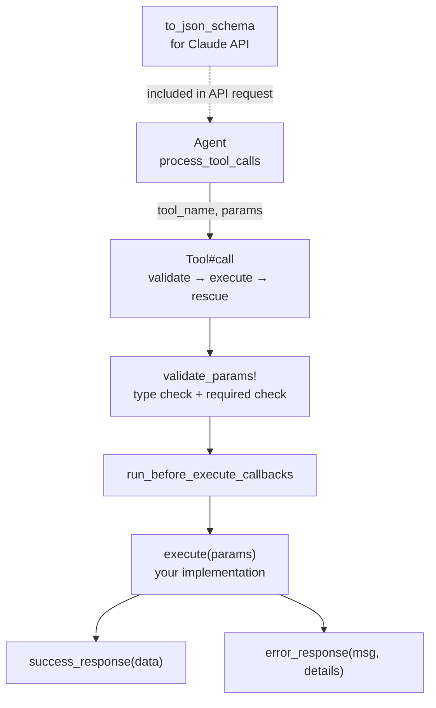

## Overview

`ActiveIntelligence::Tool` is the base class for every capability you want to expose to Claude. Define the tool's name, description, and parameters using the DSL, implement `execute`, and register it on an agent with `tool MyTool`.

Claude uses the tool's description and JSON schema to decide when and how to call it. The agent handles the dispatch — your `execute` method only needs to perform the work and return a structured response.



## Defining a Tool

```ruby
class SearchTool < ActiveIntelligence::Tool
  name "search_web"
  description "Search the web for up-to-date information on a topic."

  param :query,  type: String,  required: true,  description: "The search query"
  param :limit,  type: Integer, required: false, description: "Max results", default: 5

  def execute(params)
    results = WebSearch.run(params[:query], limit: params[:limit])
    success_response({ results: results })
  end
end
```

## DSL Reference

### `name`

The identifier Claude uses to call the tool. Defaults to the class name converted to snake_case if not set.

```ruby
name "search_web"   # Claude will call this as "search_web"
```

Source: `tool.rb:54-60`

### `description`

Tells Claude what the tool does and when to use it. Write this as if explaining to a capable colleague — be specific.

```ruby
description "Search the web for current information. Use when the user asks about recent events."
```

Source: `tool.rb:49-52`

### `param`

Declares an input parameter. Generates the JSON schema Claude sees.

```ruby
param :name,
  type:        String,   # Ruby class → JSON schema type
  required:    true,     # Raises ToolError if missing
  description: "...",    # Shown to Claude
  default:     "value",  # Applied when not provided
  enum:        ["a","b"] # Restricts allowed values
```

**Type mapping:**

| Ruby | JSON Schema |
|------|-------------|
| `String` | `"string"` |
| `Integer` | `"integer"` |
| `Float` | `"number"` |
| `Array` | `"array"` |
| `Hash` | `"object"` |
| `TrueClass` / `FalseClass` | `"boolean"` |

Source: `tool.rb:78-86`, type mapping at `tool.rb:146-156`

### `context_field`

Declares a field that must be present in the agent's context hash. Creates an accessor method for it.

```ruby
context_field :current_user, required: true

def execute(params)
  current_user.do_something  # available via accessor
end
```

Source: `tool.rb:90-101`

### `rescue_from`

Converts a specific exception into a structured error response instead of crashing the agent.

```ruby
rescue_from Net::TimeoutError, with: :handle_timeout
rescue_from StandardError do |e, params|
  error_response("Unexpected error", details: e.message)
end

private

def handle_timeout(e, params)
  error_response("Search timed out. Try a simpler query.")
end
```

Source: `tool.rb:109-112`

### `before_execute`

Runs a callback before `execute`. Useful for logging, auth checks, or metrics.

```ruby
before_execute :log_invocation

private

def log_invocation(params)
  Rails.logger.info("Tool called with: #{params}")
end
```

Source: `tool.rb:116-119`

## Execution Context

Tools can be designated to run on the backend (default) or frontend (client-side):

```ruby
class FrontendTool < ActiveIntelligence::Tool
  execution_context :frontend
  # ...
end
```

| Context | Meaning |
|---------|---------|
| `:backend` | Executed by the agent in Ruby (default) |
| `:frontend` | Agent pauses; client must execute and resume |

Source: `tool.rb:63-66`, `tool.rb:69-76`

## Convenience Subclasses

```ruby
class MyQuery < ActiveIntelligence::QueryTool   # read-only operations
class MyCommand < ActiveIntelligence::CommandTool  # write/side-effect operations
```

`QueryTool` and `CommandTool` (`tool.rb:336-342`) pre-set the `tool_type` for semantic clarity. They have no functional difference in execution.

## Response Format

Always return one of:

```ruby
# Success
success_response({ key: "value" })
# → { success: true, data: { key: "value" } }

# Error
error_response("Something went wrong", details: { code: 404 })
# → { error: true, message: "Something went wrong", details: { code: 404 } }
```

Claude receives the response as a JSON string. Structured error responses allow Claude to communicate failures to the user gracefully.

Source: `tool.rb:318-332`

## Parameter Validation

`validate_params!` (`tool.rb:232-261`) runs before `execute` and checks:
1. All `required: true` params are present
2. Values match the declared `type`
3. Values are within the declared `enum` if set
4. Context fields declared with `context_field` are present

Validation failures raise `ToolError`, which the agent catches and converts to an error response — the conversation continues rather than crashing.
