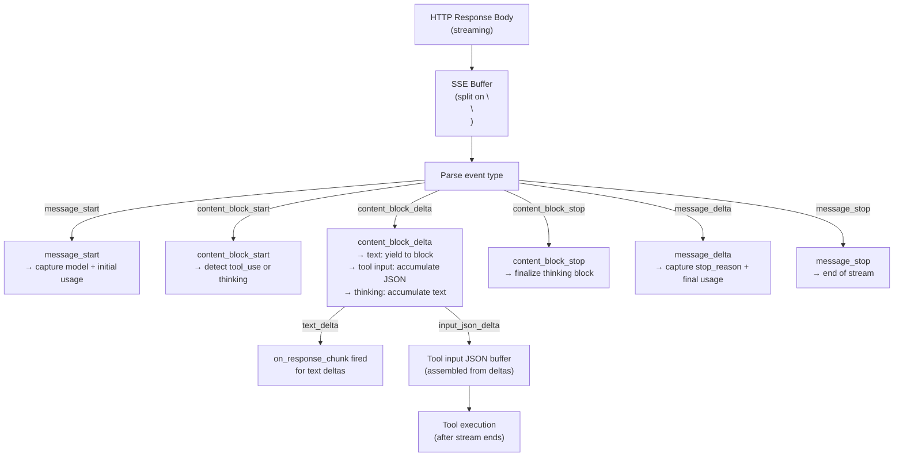

## Prerequisites

- Read [Message Flow](message_flow) and [Tool Calling Loop](tool_calling_loop)

## Overview

Streaming uses Anthropic's Server-Sent Events (SSE) format. The HTTP response body arrives as a stream of `data: {...}\n\n` lines. The agent parses each event and routes it — text deltas go to your streaming block, tool input accumulates in a buffer, thinking blocks go to callbacks.



Source: `claude_client.rb:235-388`

## SSE Event Types

### `message_start`

```json
{ "type": "message_start", "message": { "model": "claude-3-5-sonnet-latest", "usage": {...} } }
```

Captures the model name and initial usage (input tokens). Source: `claude_client.rb:271-276`

### `content_block_start`

```json
{ "type": "content_block_start", "index": 0, "content_block": { "type": "text" } }
{ "type": "content_block_start", "index": 1, "content_block": { "type": "tool_use", "id": "toolu_01", "name": "get_weather" } }
{ "type": "content_block_start", "index": 0, "content_block": { "type": "thinking" } }
```

Signals the start of a new content block. For `tool_use`, the agent registers the tool ID and name and starts an input JSON accumulation buffer. For `thinking`, it initializes a thinking tracker and fires `on_thinking_start`. Source: `claude_client.rb:293-298`

### `content_block_delta`

```json
{ "type": "content_block_delta", "delta": { "type": "text_delta", "text": "Hello" } }
{ "type": "content_block_delta", "delta": { "type": "input_json_delta", "partial_json": "{\"city\":" } }
{ "type": "content_block_delta", "delta": { "type": "thinking_delta", "thinking": "Let me consider..." } }
```

The most frequent event type:
- `text_delta` → immediately yielded to your streaming block and fires `on_response_chunk`
- `input_json_delta` → appended to the tool's input buffer
- `thinking_delta` → appended to the thinking buffer

Source: `claude_client.rb:280-303`

### `content_block_stop`

Signals end of a content block. For thinking blocks, fires `on_thinking_end`. Source: `claude_client.rb:306-313`

### `message_delta`

```json
{ "type": "message_delta", "delta": { "stop_reason": "tool_use" }, "usage": { "output_tokens": 42 } }
```

Contains the final `stop_reason` and output token count. Source: `claude_client.rb:338-349`

### `message_stop`

```json
{ "type": "message_stop" }
```

End of stream. After this event, accumulated tool calls are normalized and returned.

## Buffer Handling

The HTTP response body doesn't arrive in clean event-per-read chunks. The parser maintains a string buffer, appends each read, then splits on `\n\n` to extract complete SSE messages. Incomplete events stay in the buffer until the next read fills them in.

```ruby
buffer = ""
response.read_body do |chunk|
  buffer += chunk
  events = buffer.split("\n\n")
  buffer = events.pop || ""  # keep incomplete trailing event
  events.each { |event| process_event(event) }
end
```

Source: `claude_client.rb:241-268`

## Tool Input Accumulation

Tool input JSON is streamed as fragments via `input_json_delta`. The client accumulates these into a complete JSON string, then parses it after the `content_block_stop` event:

```
Fragment 1: '{"city":'
Fragment 2: '"Par'
Fragment 3: 'is"}'
Combined:  '{"city":"Paris"}'
Parsed:    { city: "Paris" }
```

This means tool inputs of any size work reliably — the accumulation buffer handles large schemas safely.

Source: `claude_client.rb:330-335`

## Multiple Tools in a Stream

When Claude requests multiple tools in one response, each tool gets its own `content_block_start/stop` cycle with a unique index. The client tracks tools by index in a hash:

```ruby
current_tools[index] = { id: tool_id, name: tool_name, input_buffer: "" }
```

After the stream ends, all accumulated tools are returned as the `tool_calls` array.

## Extended Thinking in Streaming

Thinking blocks appear as `content_block_start` with `type: "thinking"`, followed by `thinking_delta` events. The client:
1. Fires `on_thinking_start` with a `Thinking` payload
2. Accumulates thinking content
3. Fires `on_thinking_end` when the block stops

Thinking content is available in callbacks but is **not** passed to your streaming block — it's internal to Claude's reasoning process.

## Tool Execution Timing

Tools are **not** executed during streaming. The entire stream is consumed first, including all tool input accumulation. After `process_streaming_response` returns, the calling code in `process_tool_calls_streaming` (`agent.rb:378-486`) has the complete `tool_calls` array and executes them.

This means your streaming block receives text chunks in real time, but tool execution always happens after the stream ends.
