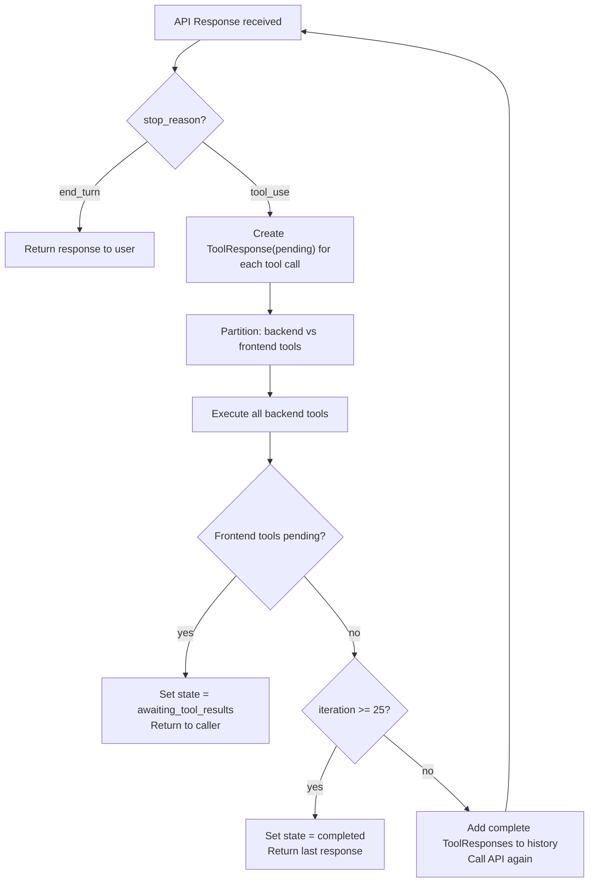

## Prerequisites

- Read [Tool](../key_concepts/tool) and [Message Flow](message_flow)

## Overview

When Claude responds with `stop_reason: "tool_use"`, the agent doesn't return to the user — it executes the requested tools, feeds the results back to Claude, and repeats. This loop continues until Claude returns `stop_reason: "end_turn"` (or the 25-iteration limit is hit).



Source: `agent.rb:281-355` (`process_tool_calls`)

## Detailed Walk-through

### Step 1: Detect tool calls

After receiving the API response, the agent checks for tool calls in the `AgentResponse`. If `tool_calls` is non-empty and `stop_reason == "tool_use"`, it enters `process_tool_calls`.

### Step 2: Create pending ToolResponses

For each tool call in the response, the agent creates a `ToolResponse` with `status: :pending`. These are added to `@messages` immediately. Pending responses are filtered out during API message formatting, so they don't appear in subsequent API calls until they're complete.

### Step 3: Partition into backend and frontend

`partition_tool_calls` (`agent.rb:700-715`) splits the tool calls into two groups:
- **Backend tools**: Execute in Ruby right now
- **Frontend tools**: Must be deferred to the client

### Step 4: Execute backend tools

`execute_tool_call_with_callbacks` (`agent.rb:638-681`) runs for each backend tool:
1. Fires `on_tool_start` with a `ToolExecution` payload
2. Finds the tool class by name
3. Calls `tool.call(params)` (which validates and executes)
4. Marks the `ToolResponse` as complete (or error)
5. Fires `on_tool_end` or `on_tool_error`

If the tool class isn't found, the `ToolResponse` is marked as error with a descriptive message — the loop continues rather than crashing.

### Step 5: Handle frontend tools

If any frontend tools are still pending after backend execution, the agent:
1. Sets `@state = STATES[:awaiting_tool_results]`
2. Returns a structured response describing the pending tools
3. Stops the loop — the caller must provide results via `continue_with_tool_results`

See [Frontend Tools](frontend_tools) for the full flow.

### Step 6: Feed results back to Claude

If all tools are complete, the formatted messages now include the `ToolResponse` results. The agent makes another API call with the full history.

`on_iteration` fires before each repeat with an `Iteration` payload containing the iteration number and tool call count.

### Step 7: Repeat or finish

The loop repeats from Step 1 until:
- Claude returns `stop_reason: "end_turn"` (normal completion)
- A frontend tool is pending (pause)
- 25 iterations are reached (sets state to `completed`, returns last response)

## Multi-Tool Turns

Claude can request multiple tools in a single response. The agent handles all of them in the same iteration, executing each backend tool in sequence before making the next API call. This means a single `send_message` call can execute N tools and make N+1 API requests.

```
Iteration 1:
  API call → tool_a, tool_b requested
  execute tool_a → complete
  execute tool_b → complete
  API call → tool_c requested
Iteration 2:
  execute tool_c → complete
  API call → end_turn
Return response
```

## Streaming Mode

The tool-calling loop in streaming mode works identically in terms of logic, but uses `process_tool_calls_streaming` (`agent.rb:378-486`) which accumulates tool input from `input_json_delta` SSE events before executing.

Your streaming block receives text chunks from each API call in the loop — including any text Claude outputs before or between tool calls.
